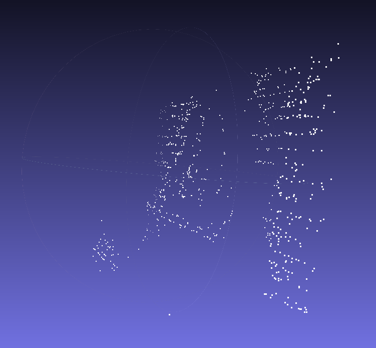
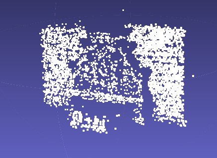

# How to Structure from Motion 

A self reliant tutorial on _Structure from Motion_ (SFM). 

 

In this repository, we provide
* Self-reliant tutorial on SFM
* SFM Pipeline Code
* Associated Booklet 

## 1. Getting Started

These instructions will get you a copy of the project up and running on your local machine for development and testing purposes.

### 1.1. Prerequisites

You need to have following libraries installed:
```
Numpy >= 1.13.1
OpenCV 3
OpenCV_contrib
```

### 1.2. Data 
Please download the standard data benchmarks from [here](https://github.com/openMVG/SfM_quality_evaluation)

<!-- ## 2. Demo/Quick Start -->

## 2. Demo/Quick Start

### 2.1. Booklet
You can download the initial draft of the booklet from [here](https://github.com/muneebaadil)

### 2.2. Tutorial Notebook 
1. Chapter 1: Prerequisites
2. Chapter 2: Epipolar Geometry
3. Chapter 3: 3D Scene Estimations
4. Chapter 4: Putting It Together: Part I
5. Chapter 5: Bundle Adjustment
6. Chapter 6: Putting It Together: Part II

### 2.3. SFM Pipeline
To run, please follow the following commands: 
```
python sfm.py --data-dir <path-to-data-directory>
```

All arguments are shown below
```
usage: sfm.py [-h] [-dataDir DATADIR] [-outName OUTDIR]
               [-printEvery PRINTEVERY] [-crossCheck CROSSCHECK]
               [-outlierThres OUTLIERTHRES] [-fundProb FUNDPROB]
```

## Author(s)

* [Muneeb Aadil](https://github.com/muneebaadil) (imuneebaadil@gmail.com)
* [Sibt Ul Hussain](https://sites.google.com/site/sibtulhussain/) (sibtul.hussain@nu.edu.pk)